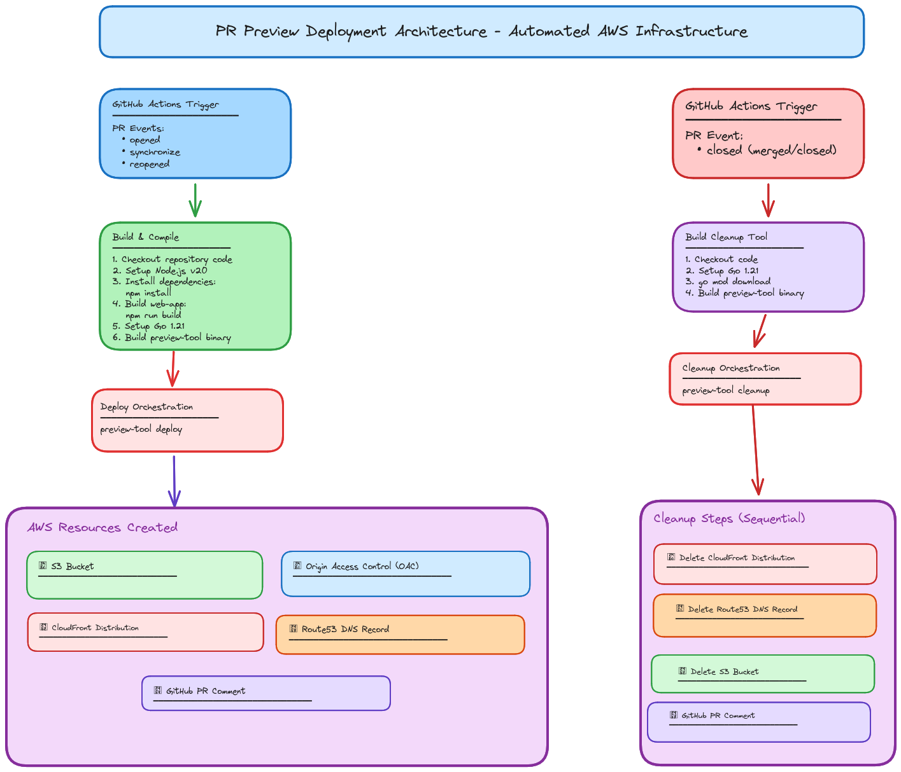

# Preview Environments

## How to create/update preview environment?
1. Make changes to `./web-app/` folder
2. Create new **Pull Request** or Update existing **Pull Request**

There will be a comment on the Pull Request with the domain where you can access it.

---

## Example Run 

https://github.com/Hunter-Thompson/preview-int/pull/1

## Architecture



### Infrastructure
- S3 for static hosting
- CloudFront for CDN and HTTPS
- Route53 for custom domain DNS
- ACM for SSL certificates 

## Automation Overview [`./preview-automation-go/`]

### Deploy Automation (PR open/sync/reopen)

1. **S3 Bucket Creation** - Creates `pr-{number}-{app}` bucket in specified region
2. **File Sync** - Uploads source directory contents to bucket
3. **Origin Access Control (OAC)** - Creates/reuses CloudFront OAC for secure S3 access
4. **CloudFront Distribution** - Creates distribution with:
   - Custom domain alias (`pr-{number}-{app}.{base-domain}`)
   - ACM certificate for SSL
5. **Bucket Policy** - Configures S3 policy allowing CloudFront access via OAC
6. **Cache Invalidation** - Invalidates all paths (`/*`) for fresh content
7. **Route53 DNS** - Creates CNAME record pointing custom domain to CloudFront
8. **GitHub Comment** - Posts preview URL to PR 

### Cleanup Automation (PR closed/merged) 

1. **CloudFront Deletion** 
2. **Route53 Record Deletion** 
3. **S3 Deletion** 
4. **GitHub Comment** 

## GitHub Workflow Overview 

```
PR Events
   │
   ├─── opened/synchronize/reopened (web-app/** changes)
   │    └─→ pr-preview-deploy.yml
   │         ├─ Build web-app (Node.js)
   │         ├─ Build preview-tool (Go)
   │         ├─ AWS OIDC Auth
   │         └─ Deploy → AWS Infrastructure
   │
   └─── closed (web-app/** changes)
        └─→ pr-preview-cleanup.yml
             ├─ Build preview-tool (Go)
             ├─ AWS OIDC Auth
             └─ Cleanup → AWS Infrastructure
```

## GitHub Workflows

### `pr-preview-deploy.yml`
**Trigger:** PR opened/sync/reopened on `web-app/**`

**Steps:**
1. Checkout code
2. Setup Node.js 20 → Build web-app (`npm install && npm run build`)
3. Setup Go 1.21 → Build preview-tool binary
4. AWS OIDC authentication (role assumption)
5. Run `preview-tool --action deploy` → Creates AWS resources

### `pr-preview-cleanup.yml`
**Trigger:** PR closed on `web-app/**`

**Steps:**
1. Checkout code
2. Setup Go 1.21 → Build preview-tool binary
3. AWS OIDC authentication (role assumption)
4. Run `preview-tool --action cleanup` → Destroys AWS resources

## Configuration

### Environment Variables
- `APP_NAME`: web-app
- `AWS_REGION`: us-east-1
- `PR_PREVIEW_BASE_DOMAIN`: preview-example.live

### Secrets Required
- `AWS_ROLE_ARN`: OIDC-enabled IAM role for AWS access
- `PR_PREVIEW_CERT_ARN`: ACM certificate for SSL (deploy only)

## Pulumi Infra [`./infra`]

1. **Creates ACM wildcard certificate** - Used for cloudfront SSL. `*.preview-example.live`
2. **Creates GitHub actions OIDC role** - Used to give access to the Deploy and Cleanup automation on GitHub actions.

## Manual steps 

Everything is done automated, except for the Route53 Hosted zone.

1. **Buy domain on godaddy `preview-example.live`**
2. **Create public hosted zone on AWS route53 `preview-example.live`**
3. **Update nameserver on godaddy with Route53 zones DNS records**

## How to recreate for another domain, AWS account, and repo?

1. **Buy domain on godaddy `preview-lottie.com`**
2. **Create public hosted zone on AWS route53 `preview-lottie.com`**
3. **Update nameserver on godaddy with Route53 zones DNS records**
4. **Update `./infra/Pulumi.dev.yaml` `baseDomain`, `hostedZoneId`, `githubOrg`, `githubRepo`**
5. **`pulumi up` inside the `./infra` folder**
6. **Update `./.github/workflows/*` envs with new `BASE_DOMAIN`**
7. **Create repo**
8. **Add secret in repo `PR_PREVIEW_CERT_ARN`, `AWS_ROLE_ARN`** - get both of these values from the output of `pulumi up`

## Reasoning behind infrastructure choices

Since the task was to host a static website, I chose S3 + CloudFront because it would require the least amount of resources. The other option would be to build a docker image with nginx and then deploy it on a server or a Kubernetes cluster.

## What I would do different

If the task was to host backend and frontend preview environments, I would create a Kubernetes operator that would manage the previews instead of using GitHub actions to create the resources using a Go app.

A full fledged preview environment setup would work best with a Kubernetes Operator.
